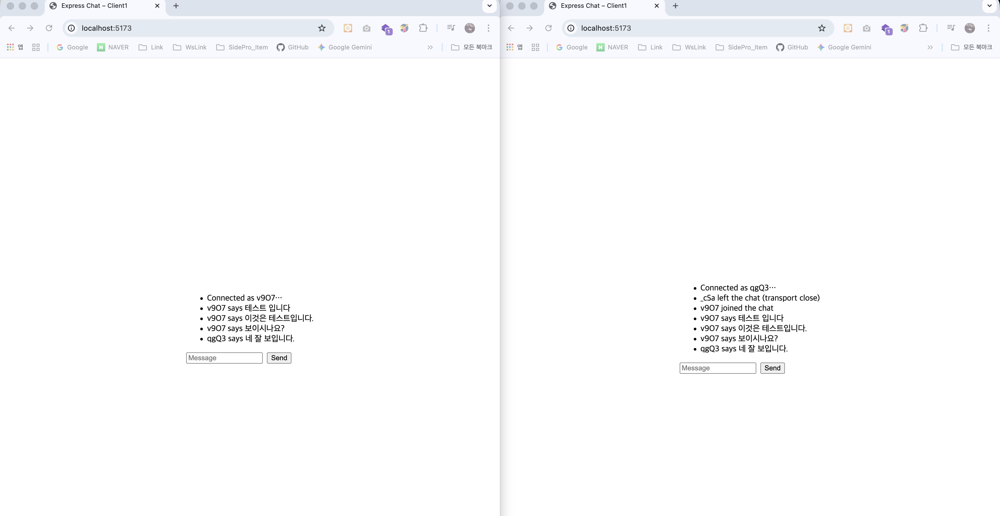

# Express Chat Monorepo

**turboRepo**를 사용하여 프론트엔드와 서버 조합을 손쉽게 확장하고 관리할 수 있도록 설계된 실시간 채팅 애플리케이션입니다. 이 모노레포 구조를 통해 여러 버전의 클라이언트와 서버를 독립적으로 개발하고 실행할 수 있습니다.

## 🌟 주요 기능 (채팅)

- **채팅방 생성 및 참여**: 사용자는 원하는 이름의 채팅방에 입장할 수 있습니다.
- **실시간 메시지 전송**: 같은 채팅방에 있는 사용자들과 실시간으로 메시지를 주고받을 수 있습니다.
- **사용자 목록**: 현재 채팅방에 참여 중인 사용자 목록을 확인할 수 있습니다.

## 📂 프로젝트 구조

이 프로젝트는 `pnpm` 워크스페이스와 turboRepo 기반으로 한 모노레포입니다. 모든 애플리케이션은 `apps` 디렉터리 내에 위치합니다.

```text
.
├── apps/
│   ├── client1/  # Vite 기반 클라이언트
│   ├── express/  # Express + Socket.IO 서버
│   └── server1/  # 순수 Node.js + Socket.IO 서버
├── package.json
├── pnpm-workspace.yaml
└── turbo.json
```

## 🛠️ 기술 스택

### Monorepo

- **turboRepo**: 모노레포를 위한 고성능 빌드 시스템
- **pnpm**: 빠르고 효율적인 패키지 매니저

### `apps/client*`

- **Vite**: 프론트엔드 개발 서버 및 번들러
- **Socket.IO Client**: 실시간 통신을 위한 클라이언트 라이브러리
- **HTML5 / CSS3 / JavaScript**

### `apps/server*`

- **Node.js**: 서버사이드 JavaScript 런타임
- **Socket.IO**: 실시간 양방향 통신 라이브러리
- **Express**: 웹 프레임워크 (`server2`, `express` 패키지에서 사용)
- **Nodemon**: 개발 환경 자동 재시작 도구 (`server2` 패키지에서 사용)

## 🚀 시작하기

### 사전 준비

이 프로젝트는 `pnpm`을 패키지 매니저로 사용합니다. `pnpm`이 설치되어 있지 않다면 먼저 설치해주세요.

```bash
npm install -g pnpm
```

### 백엔드

- **Node.js**: 서버 사이드 JavaScript 런타임
- **Express**: 웹 애플리케이션 프레임워크
- **Socket.IO**: 실시간 양방향 통신 라이브러리

### 프론트엔드

- **HTML5**
- **CSS3**
- **JavaScript (ES6 Modules)**

## 🚀 시작하기

### 1. 의존성 설치

```bash
pnpm install
```

### server1/client1 테스트 화면

### 2. 서버 실행

```bash
pnpm start
```


서버가 시작되면 브라우저에서 `http://localhost:3000` (또는 설정된 포트)으로 접속하여 채팅을 시작할 수 있습니다.

`client1`과 `server1`을 동시에 실행해 두 개의 브라우저 인스턴스로 메시지를 주고받은 결과입니다. 동일한 방식으로 다른 조합도 빠르게 확인할 수 있습니다.

## 📝 사용 방법

## 환경 변수

- 클라이언트: `apps/client*/.env.example` 참고 (`VITE_SERVER_URL` 기본값 포함)
- 서버: `PORT`, `HOST` 환경 변수를 통해 포트/호스트를 조정할 수 있습니다.

## 확장 가이드

1. `apps/` 아래에 `client3`, `server3`처럼 새로운 디렉터리를 추가합니다.
2. `package.json`과 필요한 설정 파일을 기존 예제를 복사해 수정합니다.
3. 루트 `package.json`에 `dev:client3`, `dev:server3` 스크립트를 추가합니다.
4. 공통 라이브러리는 `packages/` 디렉터리를 새로 만들어 공유 패키지로 분리할 수 있습니다.

이 구조를 바탕으로 다양한 프론트/백엔드 조합을 실험해 보세요.

1.  메인 페이지에서 **유저이름**과 **방 이름**을 입력하고 '입장' 버튼을 클릭합니다.
2.  채팅방에 입장하면 다른 사용자들과 메시지를 주고받을 수 있습니다.
