# Express Chat Monorepo

**turboRepo + pnpm** 기반으로 구성된 실시간 채팅 모노레포입니다. `apps/` 하위에 여러 서버·클라이언트가 공존하고, 공통 의존성을 공유하면서 빠르게 새로운 조합을 추가할 수 있습니다. 최근에는 **Express + Socket.IO** 조합(`apps/express`)을 집중적으로 개선했고, 관련 실행 플로우와 화면을 본 문서에서 정리합니다.

## 📂 프로젝트 구조

```text
.
├── apps/
│   ├── client1/        # Vite + Socket.IO Client
│   ├── express/        # Express + Socket.IO 서버 (현재 메인)
│   └── server1/        # Node.js + Socket.IO 서버 예제
├── public/img/         # 공용 스크린샷 모음
├── package.json        # 루트 스크립트 (예: pnpm dev:express)
├── pnpm-lock.yaml
├── pnpm-workspace.yaml
└── turbo.json
```

## 🛠 기술 스택 & 모듈

- **Monorepo 도구**: pnpm workspaces, TurboRepo
- **서버 (apps/express)**: Express 5, Socket.IO 4, Node.js
- **클라이언트 (정적 템플릿)**: HTML/CSS/Vanilla JS + Mustache 템플릿
- **유틸**:
  - `apps/express/src/utils/users.js` : 사용자 입·퇴장 및 중복 처리
  - `apps/express/src/utils/messages.js` : 서버 공용 메시지 포맷

## 🚀 실행 방법

1. **의존성 설치**

   ```bash
   pnpm install
   ```

2. **Express 서버 실행**

   ```bash
   pnpm dev:express
   ```

   - 루트 `package.json`의 `dev:express` 스크립트가 `pnpm --filter @express-chat/express dev`를 호출합니다.
   - 워크스페이스 내부(`apps/express/package.json`)의 `dev` 스크립트는 `node index.js`를 실행하며, `index.js`는 `src/index.js`를 불러와 서버와 Socket.IO를 같은 HTTP 서버에서 구동합니다.

3. **접속**

   - 브라우저에서 `http://localhost:8081` 진입 → 닉네임·방 이름 입력 → `입장`.
   - 동일 방에 다른 브라우저/탭으로 재접속하면 실시간으로 사용자 목록과 메시지가 동기화됩니다.

## ✨ 주요 기능

- **입장/퇴장 브로드캐스트**: `generateMessage` 헬퍼를 통해 Admin 메시지 출력.
- **유저명 중복 검사**: `addUser`가 같은 방 내 중복 닉네임을 거부하고 오류 콜백 반환.
- **실시간 메시지**: `sendMessage` ACK를 활용해 클라이언트 폼 상태를 안정적으로 초기화.
- **사이드바 인원수 갱신**: `roomData` 이벤트로 Mustache 템플릿을 업데이트.

## 💬 Private Chat 앱 (`apps/privateChat`)

몽고DB와 Socket.IO를 연결해 1:1 비공개 채팅을 제공하는 신규 앱입니다. 닉네임으로 로그인하면 고유 토큰을 발급받고, 해당 토큰을 기준으로 과거 대화가 모두 복구됩니다.

- **세션 유지**: 로컬스토리지에 저장된 닉네임/토큰을 재활용해 새로고침 후에도 자동 로그인.
- **대화 기록 저장**: `mongoose` 모델을 이용해 사용자 쌍별 대화를 영구 저장하고, 입장 시 바로 불러옵니다.
- **실시간 알림**: 상대 창을 보고 있지 않을 때는 리스트 아이템에 뱃지를 띄워 신규 메시지를 알려줍니다.
- **오프라인 메시지 지원**: 상대가 오프라인으로 전환돼도 대화 목록에 그대로 남고 메시지를 남길 수 있으며, 재접속 시 자동으로 동기화됩니다.
- **채팅방 나가기**: 사이드바의 `채팅방 나가기` 버튼으로 소켓을 정리하고 세션도 안전하게 초기화합니다.

### 실행

```bash
pnpm dev:privateChat
# 혹은
pnpm --filter @express-chat/private-chat dev
```

환경 변수 파일(`apps/privateChat/.env`)에 `MONGODB_URI`를 지정해야 하며, 서버와 Socket.IO는 동일 포트(기본 8085)에서 동작합니다.

### 화면 캡처 (`public/img/pc*.png`)

1. **로그인 화면** – `pc2.png`  
   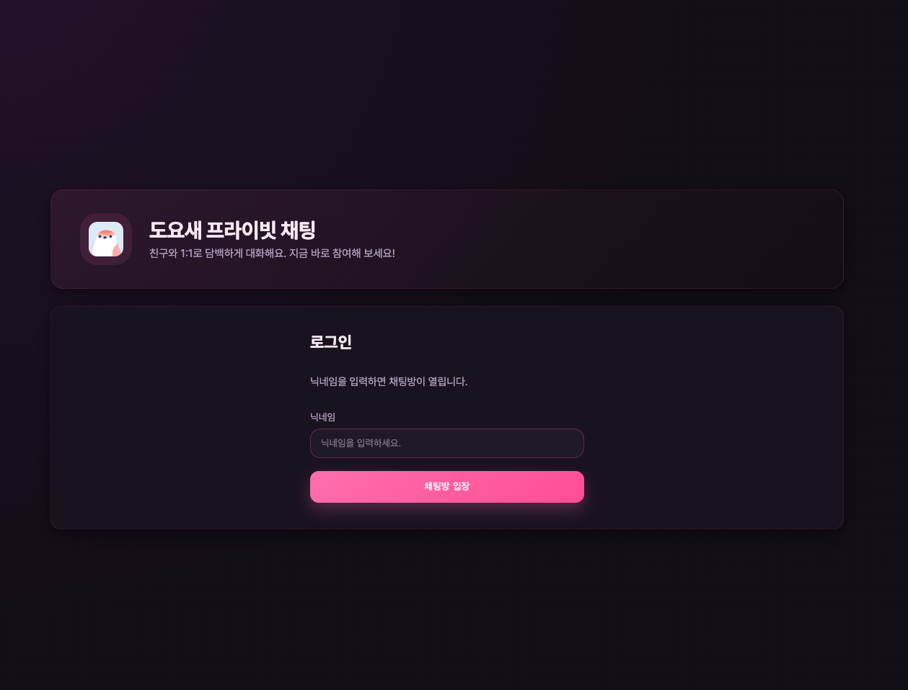
2. **로그인 완료 후 채팅방 대기** – `pc3.png`  
   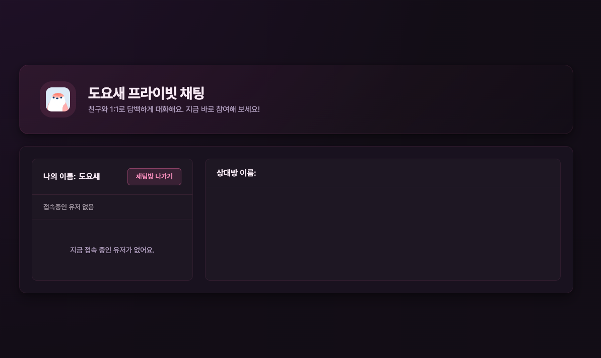
3. **다른 세션에서 메시지 도착 알림** – `pc4.png`  
   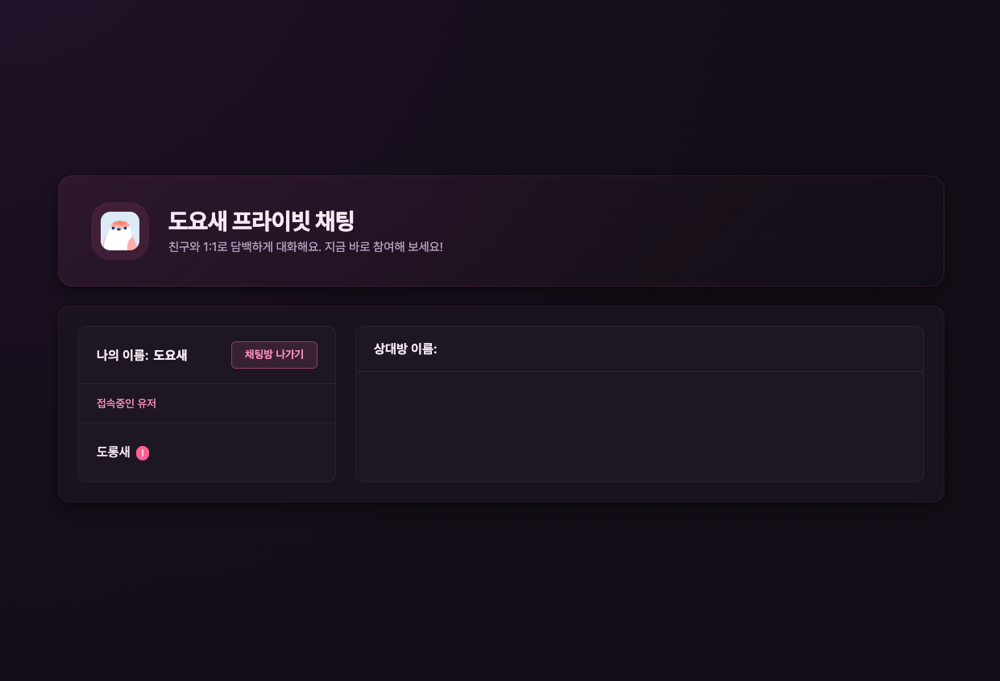
4. **실시간 1:1 대화** – `pc5.png`  
   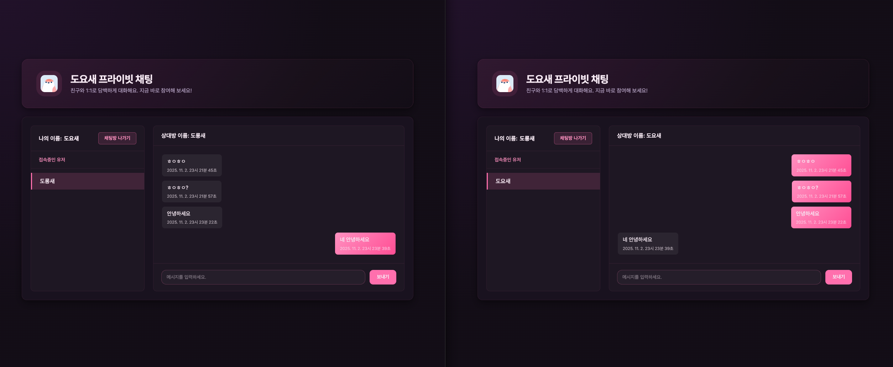
5. **오프라인 상대에게 메시지 남기기** – `pc6.png`  
   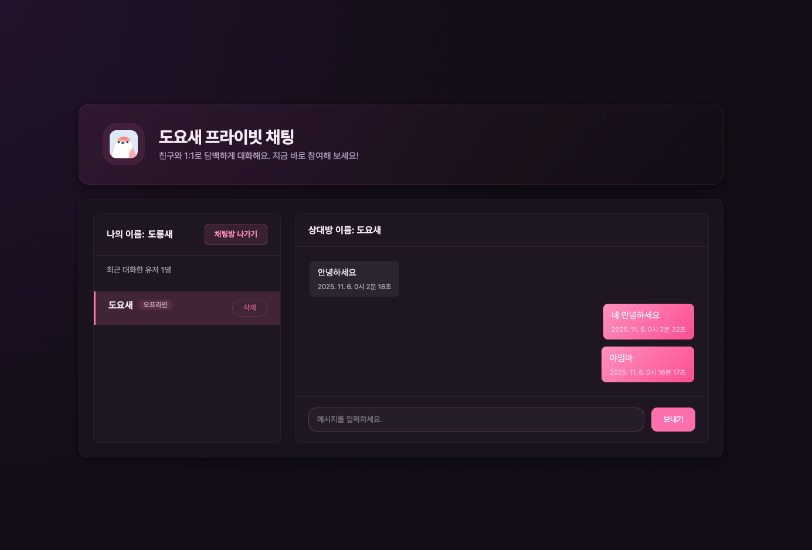
6. **반응형 UI (데스크톱/모바일 비교)** – `pc7.png`  
   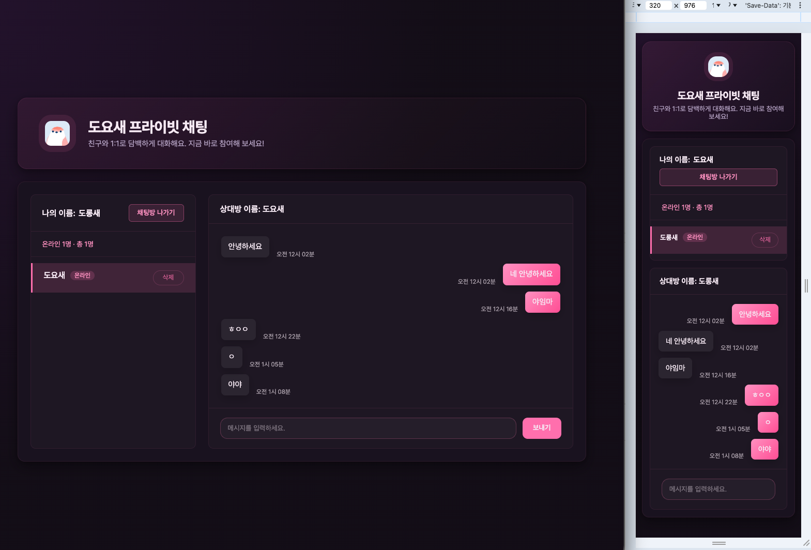

## 🖼 화면 흐름

루트 `public/img` 디렉터리에 저장된 캡처를 그대로 참조해 주요 상태를 설명합니다.

### 1. 최초 방 생성 (`public/img/express1-join.png`)
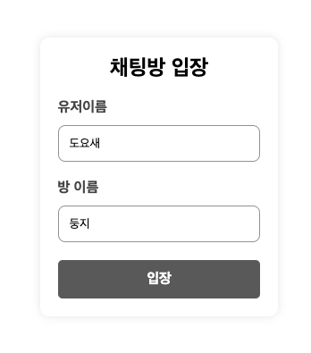

### 2. 첫 번째 입장자 화면 (`public/img/express1-chat1.png`)
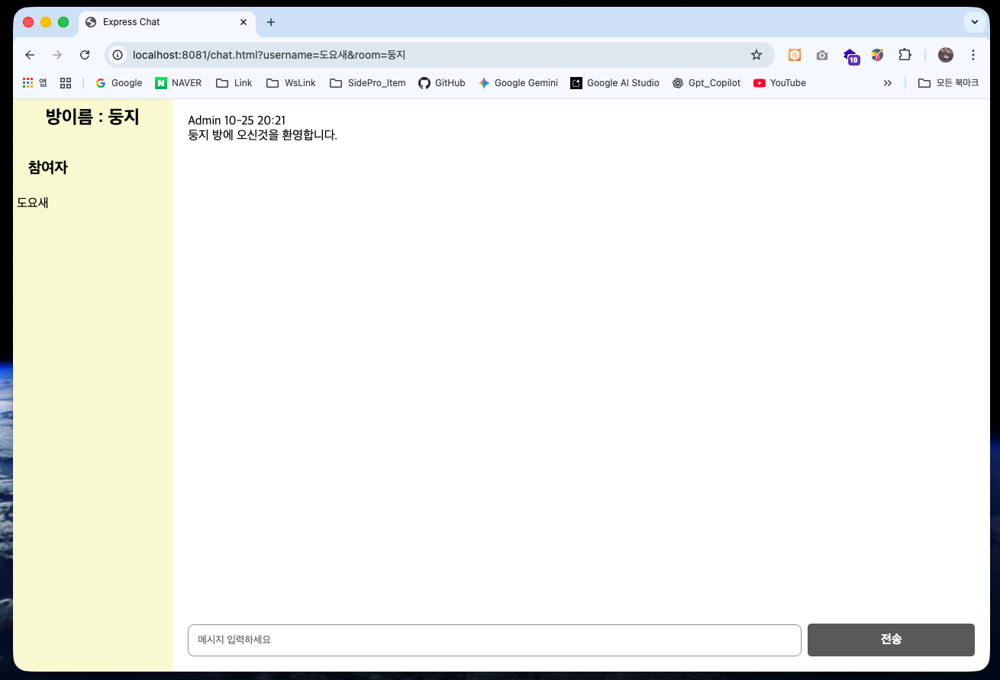

### 3. 이름 중복 경고 (`public/img/express1-idDuplication.png`)
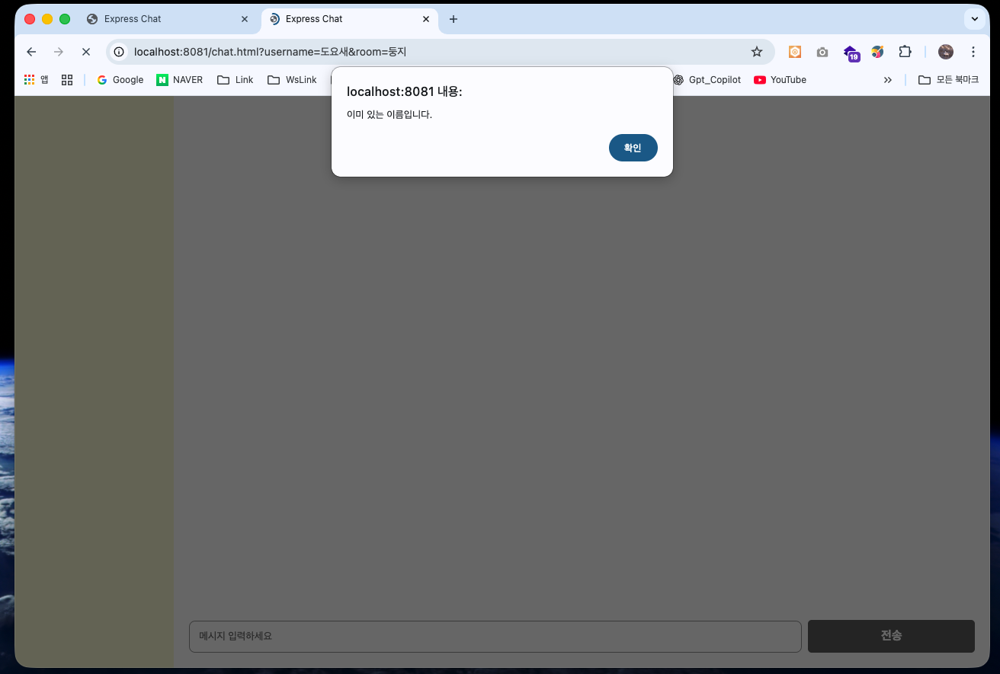

### 4. 두 번째 입장자 화면 (`public/img/express1-chat2.png`)
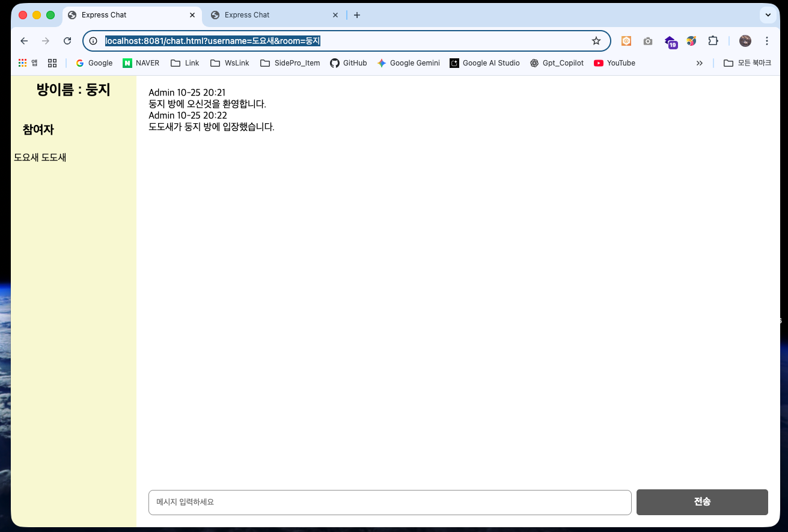

### 5. 유저 퇴장 알림 (`public/img/express1-leave.png`)
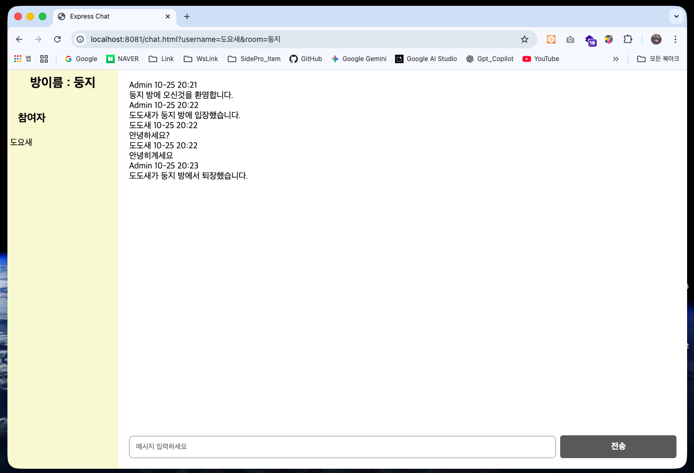

## 🔌 기타 스크립트

- `pnpm dev` : TurboRepo를 통해 등록된 모든 앱의 `dev` 파이프라인 실행
- `pnpm build` / `pnpm lint` : 각 워크스페이스의 `build`/`lint`를 Turbo 파이프라인으로 호출
- `pnpm dev:client1`, `pnpm dev:server1` : 특정 워크스페이스만 필터링해서 실행

## 📝 확장 가이드

1. `apps/` 아래 새 디렉터리 생성 (`client2`, `server2` 등).
2. 필요한 `package.json`, 소스, 정적 자산을 복사/수정.
3. 루트 `package.json` `scripts`에 `dev:<name>` 등 새 명령 추가.
4. 공용 모듈(유저/메시지 로직 등)이 많아지면 `packages/` 하위에 공유 패키지를 만들고 워크스페이스에 포함시킵니다.

Express 예제처럼 서버/클라이언트가 분리돼 있어도, 공통 스크립트와 에셋을 재사용하면서 다양한 조합을 빠르게 시도할 수 있습니다. 원하는 기능을 `apps/*` 안에 추가하고 루트 스크립트로 연결해 보세요!
